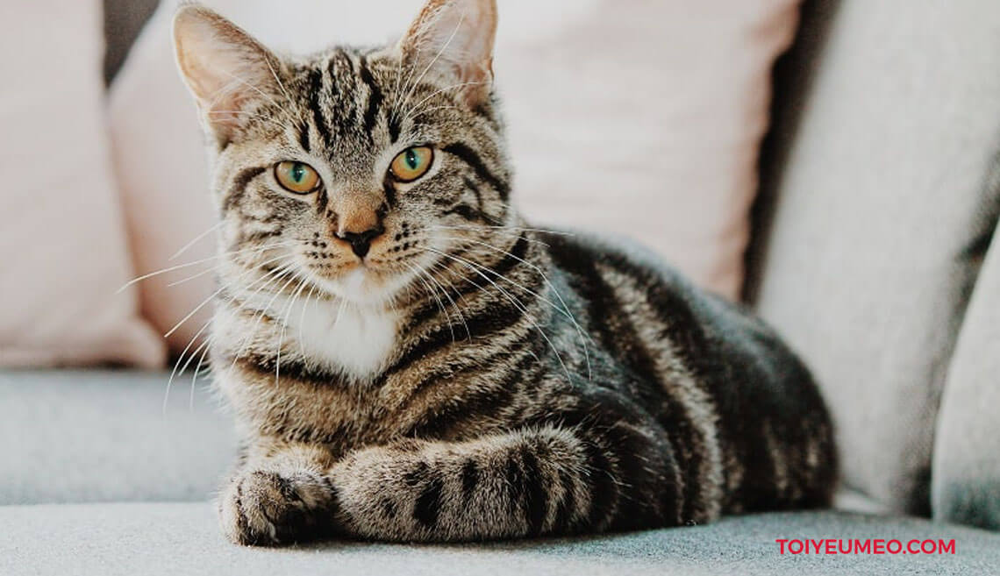
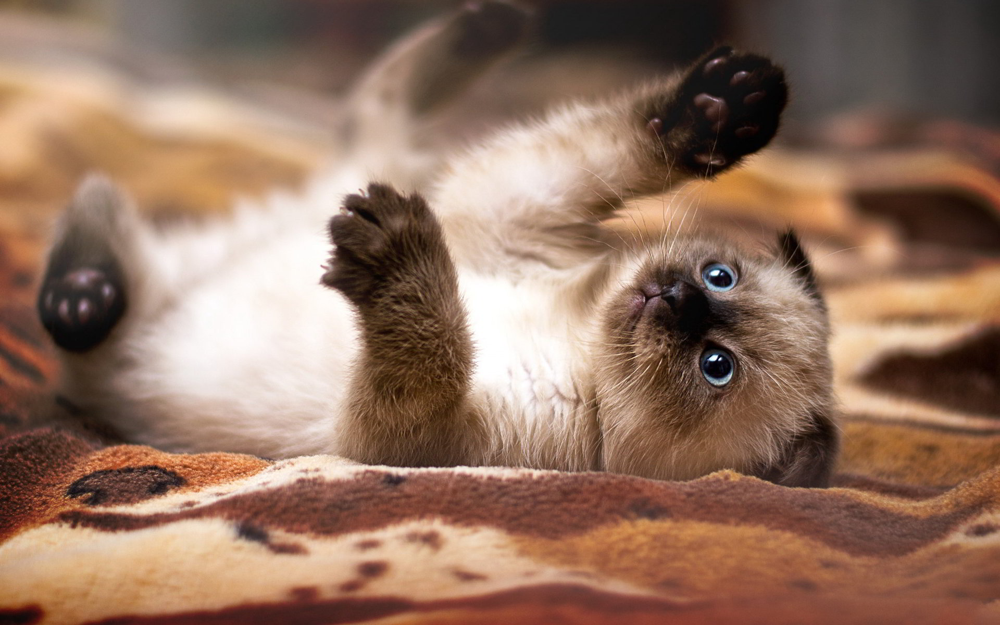
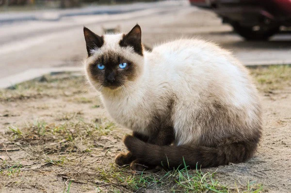
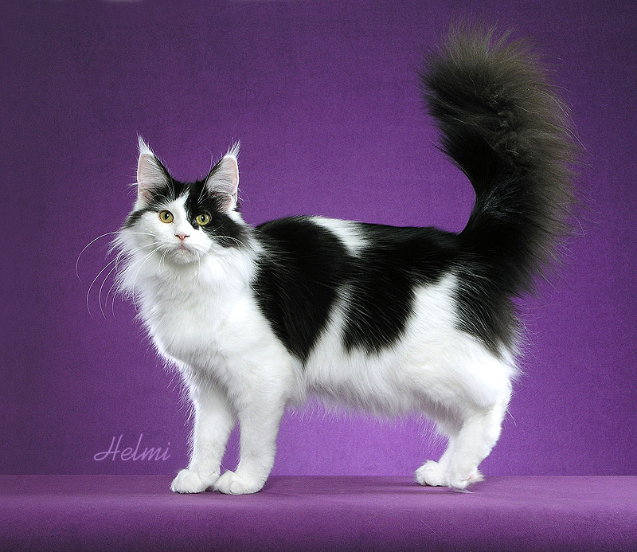

<html> 
<head> 
<meta charset="UTF-8">
</head>
<body background='meo.jpg'>
      <h1 align="center"> Đây là 1 website về các loài Mèo </h1>
<i>Mèo (chính xác hơn là loài mèo nhà để phân biệt với các loài trong họ Mèo khác) là động vật có vú, nhỏ nhắn và chuyên ăn thịt, sống chung với loài người, được nuôi để săn vật gây hại hoặc làm thú nuôi cùng với chó nhà. Mèo nhà đã sống gần gũi với loài người ít nhất 9.500 năm,[4] và hiện nay chúng là con vật cưng phổ biến nhất trên thế giới.

Có rất nhiều các giống mèo khác nhau, một số không có lông hoặc không có đuôi, và chúng có nhiều màu lông khác nhau. Mèo là những con vật có kỹ năng của thú săn mồi và được biết đến với khả năng săn bắt hàng nghìn loại sinh vật để làm thức ăn, ví dụ như chuột. Chúng đồng thời là những sinh vật thông minh, và có thể được dạy hay tự học cách sử dụng các công cụ đơn giản như mở tay nắm cửa hay giật nước trong nhà vệ sinh.

      <h3> Link dẫn đến tiểu sử: </h3>
  <a href ="https://vi.wikipedia.org/wiki/M%C3%A8o">Wikipedia.com/Mèo</a>
  <h3>Đặc điểm của Mèo:</h3>
 <ol>
   <li><a href ="https://vi.wikipedia.org/wiki/M%C3%A8o#%C4%90%E1%BA%B7c_%C4%91i%E1%BB%83m_th%E1%BB%83_ch%E1%BA%A5t">Đặc điểm thể chất</a></li>
<ol type = "I">
  <li><a href ="https://vi.wikipedia.org/wiki/M%C3%A8o#Tai">Tai</a></li>
  <li><a href ="https://vi.wikipedia.org/wiki/M%C3%A8o#Ch%C3%A2n">Chân</a></li>
  <li><a href ="https://vi.wikipedia.org/wiki/M%C3%A8o#Ho%E1%BA%A1t_%C4%91%E1%BB%99ng">Hoạt động</a></li>
   </ol>
  <li><a href ="https://vi.wikipedia.org/wiki/M%C3%A8o#Tr%C3%A8o_cao_v%C3%A0_ng%C3%A3">Trèo cao và ngã</a></li>
  <li><a href ="https://vi.wikipedia.org/wiki/M%C3%A8o#Gi%C3%A1c_quan">Giác quan</a></li>
  <li><a href ="https://vi.wikipedia.org/wiki/M%C3%A8o#Sinh_s%E1%BA%A3n_v%C3%A0_di_truy%E1%BB%81n">Sinh sản và di truyền</a></li>
  <li><a href ="https://vi.wikipedia.org/wiki/M%C3%A8o#S%E1%BB%91_l%C6%B0%E1%BB%A3ng_qu%C3%A1_%C4%91%C3%B4ng">Số lượng quá đông</a></li>
  <li><a href ="https://vi.wikipedia.org/wiki/M%C3%A8o#C%C3%A1c_gi%E1%BB%91ng">Các giống</a></li>
  <li><a href ="https://vi.wikipedia.org/wiki/M%C3%A8o#M%C3%A8o_hoang">Mèo hoang</a></li>
  <li><a href ="https://vi.wikipedia.org/wiki/M%C3%A8o#L%E1%BB%8Bch_s%E1%BB%AD_v%C3%A0_th%E1%BA%A7n_tho%E1%BA%A1i">Lịch sử và thần thoại</a></li>

  </ol>
  <h3> MỘT SỐ HÌNH ẢNH CỦA CÁC LOÀI MÈO:</h3>

  <h3> NHỮNG THÔNG TIN LIÊN QUAN KHÁC </h3>

<table border="2" width="100%">
 <tr>
   <th>MÈO</th>
  </tr>
<tr>
      <td align="center"><a href ="https://vi.wikipedia.org/wiki/H%E1%BB%8D_M%C3%A8o">Những loài còn tồn tại của họ MÈO</a></td>
  </tr>
<tr>
  <td align="center"><a href ="https://vi.wikipedia.org/wiki/H%C3%ACnh_t%C6%B0%E1%BB%A3ng_%C4%91%E1%BB%99ng_v%E1%BA%ADt_trong_v%C4%83n_h%C3%B3a">Động vật trong văn hoá</a></td>
  </tr>
  </table>

<h3>Cho mình xin ý kiến của mấy bạn về website của mình nhé</h3>
  

<form>
<input type ="text" placeholder="Ý kiện của bạn"/>
      <button type ="button">Gửi</button>
      </form>
      

